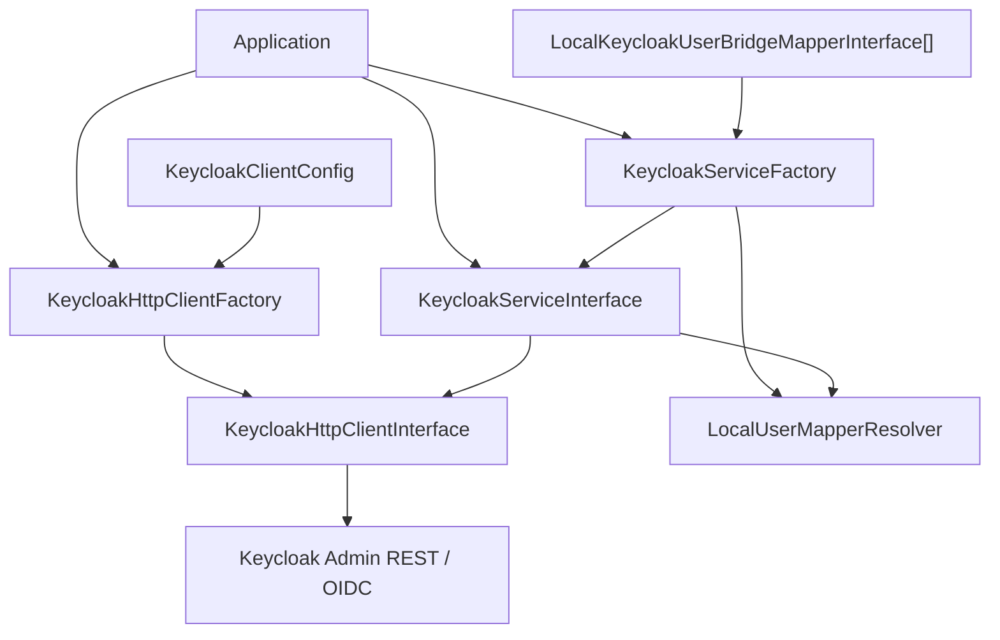

# Keycloak PHP Client

Framework-agnostic Keycloak client with a service layer and a thin orchestration facade.

## Requirements

- PHP 8.3+

## Installation

```bash
composer require apacheborys/keycloak-php-client
```

## Architecture



- `KeycloakClientConfig` - immutable connection/config value object for Keycloak client credentials.
- `KeycloakHttpClientFactory` - builds `KeycloakHttpClientInterface` from PSR-18/PSR-17 dependencies.
- `KeycloakHttpClient` - low-level HTTP facade over Keycloak Admin/OIDC endpoints.
- `KeycloakServiceFactory` - builds service graph with sane defaults around `KeycloakService`.
- `KeycloakService` - orchestration layer (user lifecycle + role sync + OIDC/JWT services composition).

Main service components:

- `KeycloakUserManagementService`
- `KeycloakRoleManagementService`
- `KeycloakUserIdentifierAttributeService`
- `KeycloakOidcAuthenticationService`
- `KeycloakJwtVerificationService`
- `KeycloakRealmService`

Recommended composition flow:

1. Build transport dependencies via `KeycloakHttpClientFactory`.
2. Build service facade via `KeycloakServiceFactory`.
3. Use `KeycloakServiceInterface` in your application code.

Core design ideas:

- the service layer is the primary integration boundary for application code;
- the transport layer maps directly to Keycloak Admin REST and OIDC endpoints underneath the service layer;
- the service layer owns multi-step workflows and application-facing orchestration;
- realm user-profile mutations are handled as lossless document updates, so unknown Keycloak fields are preserved;
- protocol mapper upsert relies on dedicated mapper endpoints instead of optional embedded fields inside client-scope list responses.

Applied patterns:

- Factory: `KeycloakHttpClientFactory`, `KeycloakServiceFactory`
- Facade: `KeycloakHttpClientInterface`, `KeycloakServiceInterface`
- Strategy + Resolver: `LocalKeycloakUserBridgeMapperInterface`, `LocalUserMapperResolver`
- Query Object: `SearchUsersDto`
- Lossless document model: `UserProfileDto`, `AttributeDto`, `UserProfileGroupDto`

## Quick Start

```php
use Apacheborys\KeycloakPhpClient\DTO\Request\SearchUsersDto;
use Apacheborys\KeycloakPhpClient\Http\KeycloakHttpClientFactory;
use Apacheborys\KeycloakPhpClient\Service\KeycloakServiceFactory;
use Apacheborys\KeycloakPhpClient\ValueObject\KeycloakClientConfig;

$config = new KeycloakClientConfig(
    baseUrl: 'http://localhost:8080',
    clientRealm: 'master',
    clientId: 'backend',
    clientSecret: 'secret',
);

$httpFactory = new KeycloakHttpClientFactory();
$httpClient = $httpFactory->create(
    config: $config,
    httpClient: $psr18Client,
    requestFactory: $psr17RequestFactory,
    streamFactory: $psr17StreamFactory,
);

$serviceFactory = new KeycloakServiceFactory();
$service = $serviceFactory->create(
    httpClient: $httpClient,
    mappers: [$yourLocalUserMapper],
);

$tokenResponse = $service->loginUser($localUser, 'PlainPassword123!');
$isValid = $service->verifyJwt($tokenResponse->getAccessToken()->getRawToken());
$freshKeycloakUser = $service->findUser($localUser);
$matchedUsers = $service->searchUsers(
    new SearchUsersDto(
        realm: 'master',
        email: 'user@example.com',
        exact: true,
    ),
);
```

## Local User Contract

When your application passes a local user object into the service layer, `KeycloakUserInterface::getId()` must return the stable local application identifier as `int`, `string` or `Ramsey\Uuid\UuidInterface`.

`KeycloakUserInterface::getKeycloakId()` may return `null`. This lets applications use this library even when their local user table cannot store the Keycloak user id. For local entities that do store it, returning the id is still recommended because it enables direct lookup and additional mapper validation.

For existing-user operations, the service layer resolves the target Keycloak user id in this order:

1. use `KeycloakUserInterface::getKeycloakId()` directly when the value is available;
2. otherwise search Keycloak users by the mapper-provided local-id attribute DTO;
3. throw `LogicException` when the local-id lookup does not return exactly one Keycloak user.

The local-id lookup attribute is provided by `LocalKeycloakUserBridgeMapperInterface::getLocalUserIdAttribute(...)` as `AttributeValueDto`. That DTO carries both the attribute name and the lookup value, so `KeycloakUserLookup` does not read `KeycloakUserInterface::getId()` directly. The same DTO can also be used in `CreateUserProfileDto` and `UpdateUserProfileDto` attribute collections. Use `LocalKeycloakUserBridgeMapperInterface::DEFAULT_LOCAL_USER_ID_ATTRIBUTE_NAME` (`external-user-id`) when the default convention is enough.

Mapper-created DTOs still carry identity metadata:

- `UpdateUserDto::getUserId()` and `DeleteUserDto::getUserId()` may contain the target Keycloak user id, but the service layer is authoritative and will populate it before calling HTTP;
- `UpdateUserDto::getLocalUserId()` and `DeleteUserDto::getLocalUserId()` contain the local id from `KeycloakUserInterface::getId()`;
- the local id is metadata for service validation and is not sent in the Keycloak JSON payload.

For creation there is no Keycloak user id yet. If you need to persist the local id in Keycloak, map it into `CreateUserProfileDto` attributes, for example through an `external-user-id` attribute.

`updateUser(...)` matches old and new local versions by `getId()`. If either version exposes a Keycloak id, the service validates that the mapper-created DTO targets the same Keycloak user. `deleteUser(...)` performs the same local-id validation against the mapper-created delete DTO.

`findUser(...)` resolves the realm through your mapper, resolves the target Keycloak id with the same Keycloak-id-first/local-id-attribute strategy, and then loads the current representation through the dedicated user-by-id endpoint.

For user repository search, the service layer also exposes `searchUsers(SearchUsersDto $dto)`. `SearchUsersDto` is accepted directly because it acts as a stable query object with realm, filters and pagination, not as a raw HTTP request payload.

Role synchronization is controlled by `LocalKeycloakUserBridgeMapperInterface::prepareLocalUserRolesForKeycloakUserCreation(...)` and `prepareLocalUserRolesForKeycloakUserUpdate(...)`. Those methods return `UserRolesDto` with final Keycloak role names, including any application-specific prefixes or suffixes. Returning null or an empty role list means the service skips role synchronization for that operation; returning roles means the service creates missing realm roles and synchronizes user mappings.

User profile mapping and role mapping are separate contracts. User management does not request available roles or read roles from `CreateUserProfileDto` / `UpdateUserDto`; role synchronization resolves the target user through the shared service-layer lookup helper and then applies only the role diff.

## Recommended Integration Style

Application code should integrate with `KeycloakServiceInterface`.

Why:

- it keeps Keycloak-specific orchestration out of application code;
- it centralizes mapper resolution, branching decisions and workflow defaults;
- it lets the transport layer stay replaceable and specialized without becoming your runtime API.

`KeycloakHttpClientInterface` still exists, but it should be treated as infrastructure used by the service layer and by custom library extensions, not as the normal application entry point.

## User Identifier Attribute Quick Example

```php
use Apacheborys\KeycloakPhpClient\DTO\Request\EnsureUserIdentifierAttributeDto;

$service->ensureUserIdentifierAttribute(
    realm: 'master',
    dto: new EnsureUserIdentifierAttributeDto(
        attributeName: 'external-user-id',
        displayName: 'External user id',
        createIfMissing: true,
        exposeInJwt: true,
        clientScopeName: 'profile',
        jwtClaimName: 'external_user_id',
    ),
);
```

Behavior:

- if the user-profile attribute is missing and `createIfMissing=false` -> throws exception;
- if missing and `createIfMissing=true` -> creates attribute in realm user profile;
- if `exposeInJwt=true` -> resolves the target client scope and creates or updates protocol mapper in selected client scope.

For auto-created identifier attributes, the default user-profile payload also marks the attribute as required for `admin` and `user`.

This workflow is intended for bootstrap or migration-like initialization of application-specific identifier attributes:

- the application can ensure that a realm contains the attribute it depends on;
- the same identifier can be exposed as a JWT claim to avoid extra lookups to Keycloak or another repository on hot paths;
- the implementation keeps the supported surface intentionally small while preserving unknown upstream Keycloak fields.

## Documentation

Detailed docs are in [`docs/README.md`](docs/README.md):

- architecture and layering;
- service-layer orchestration and responsibilities;
- transport-layer modules and contracts;
- user profile attributes and JWT exposure flow;
- client scopes and protocol mappers;
- testing strategy and local checks.

## Quality Checks

```bash
composer test
composer phpcs
composer phpstan
composer rector
```

## License

MIT. See [LICENSE](LICENSE).
