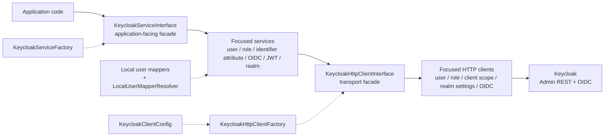
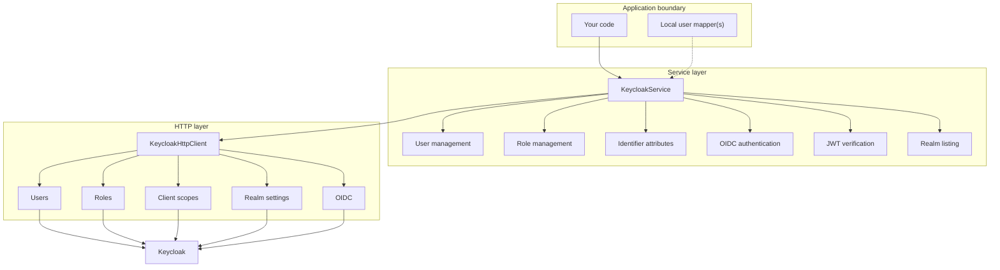
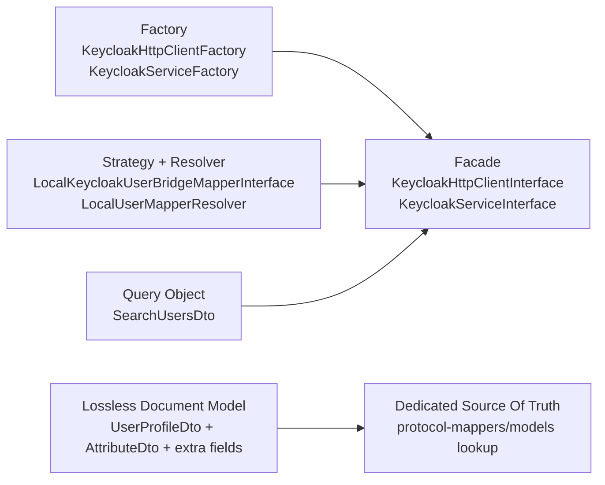
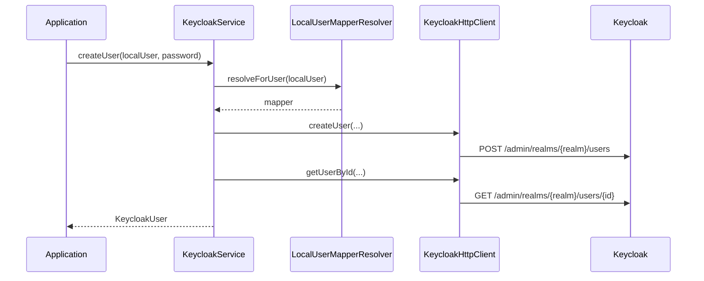

# Architecture

## Goals

The library is designed around a few explicit goals:

- keep Keycloak Admin REST and OIDC access available through a focused transport foundation;
- keep multi-step workflows outside of the low-level HTTP layer;
- expose a pragmatic service API for common application workflows without pretending to model the entire Keycloak domain;
- stay extensible when Keycloak returns fields or configurations the library does not manage directly.

## Non-Goals

The library intentionally does not try to:

- model the entire Keycloak Admin REST schema as a complete domain model;
- hide every Keycloak concept behind application-specific abstractions;
- make application code orchestrate Keycloak endpoint flows directly.

## Architectural Overview

This overview intentionally shows only runtime boundaries. Detailed composition is documented in the sections below and in the service/HTTP layer pages.

Solid arrows show the main runtime call path. Dotted arrows show wiring or supporting dependencies.

## Layer Model

## Layers

The library is split into two main layers:

- HTTP layer (`src/Http/*`) for direct Keycloak REST/OIDC interaction.
- Service layer (`src/Service/*`) for orchestration and business workflows.

For application code, the service layer is the intended runtime boundary. The HTTP layer exists underneath it as transport infrastructure and as an extension point for custom service composition.

## Entry Points

- `KeycloakHttpClientFactory` creates `KeycloakHttpClientInterface`.
- `KeycloakServiceFactory` creates `KeycloakServiceInterface`.

## HTTP Composition

`KeycloakHttpClient` is a facade over specialized clients:

- `UserManagementHttpClient`
- `RoleManagementHttpClient`
- `ClientScopeManagementHttpClient`
- `RealmSettingsManagementHttpClient`
- `OidcInteractionHttpClient`

## Service Composition

`KeycloakService` is an orchestrator over focused services:

- `KeycloakUserManagementService`
- `KeycloakRoleManagementService`
- `KeycloakUserIdentifierAttributeService`
- `KeycloakOidcAuthenticationService`
- `KeycloakJwtVerificationService`
- `KeycloakRealmService`

Mapper resolution for local users is handled by `LocalUserMapperResolver` and `LocalKeycloakUserBridgeMapperInterface`.
`KeycloakServiceFactory` is the composition root for service helpers: it creates one `KeycloakUserLookup` and injects it into the management services that need Keycloak user resolution.

Local user identity is split into two coordinates:

- `KeycloakUserInterface::getId()` is the stable local application id and must return `int`, `string` or `Ramsey\Uuid\UuidInterface`;
- `KeycloakUserInterface::getKeycloakId()` is the Keycloak user id and may be `null` for applications that cannot persist it locally.

The service layer is authoritative for choosing how to identify the user in Keycloak. It uses `getKeycloakId()` first because the direct user-by-id endpoint is the cheapest lookup, then falls back to searching by the local-id user attribute returned from `LocalKeycloakUserBridgeMapperInterface::getLocalUserIdAttributeName(...)`. The default attribute-name convention is `LocalKeycloakUserBridgeMapperInterface::DEFAULT_LOCAL_USER_ID_ATTRIBUTE_NAME` (`external-user-id`).

Mapper-created DTOs for existing-user operations carry the local id as service metadata. Their Keycloak id may be null; services resolve and populate the final transport DTO before calling HTTP.

## Boundary Rules

### HTTP layer

The HTTP layer should answer questions like:

- which Keycloak endpoint is called;
- which DTO is sent or returned;
- how errors are surfaced.

The HTTP layer should not decide business workflows such as:

- whether a missing attribute should be auto-created;
- whether a mapper should be created or updated;
- how local application users are mapped to realms.

### Service layer

The service layer owns orchestration and application-facing intent:

- resolve local-user mapping;
- combine multiple HTTP calls into one higher-level operation;
- enforce workflow decisions and defaults;
- keep the calling application away from Keycloak-specific multi-step coordination.

## Design Principles

### Thin transport, richer orchestration

`KeycloakHttpClient` is intentionally a thin facade over focused transport clients. The service layer is the place where workflows become meaningful to application code, and it is the boundary application code should depend on.

### Open-door document handling

Some Keycloak APIs behave like document APIs, especially realm user-profile configuration. The library intentionally preserves unknown fields when reading and writing those documents, so unsupported upstream fields are not silently deleted during partial updates.

### Dedicated source of truth over incidental response shape

When a feature has a specialized endpoint, prefer that endpoint over optional embedded fields from another representation. The protocol-mapper lookup flow follows this rule by reading mapper models from `/protocol-mappers/models` instead of relying on `protocolMappers` being embedded in `ClientScopeRepresentation`.

## Patterns In Use

Pattern notes:

- Factories keep wiring and dependency composition out of application code.
- Facades keep the public surface compact while allowing the internals to stay specialized.
- `KeycloakServiceInterface` is the application-facing facade; `KeycloakHttpClientInterface` is an infrastructural facade used below it.
- Mapper strategy objects isolate application-specific realm and profile mapping rules from transport logic.
- Mapper strategy objects compile final Keycloak role names in user profile DTOs, including application-specific prefixes or suffixes.
- `SearchUsersDto` is treated as a query object because it captures search intent, not a raw REST payload.
- The lossless document model preserves unknown Keycloak fields during read-modify-write cycles.
- Dedicated lookup endpoints are preferred whenever response shape from aggregate endpoints is optional or unstable.

## Typical Flow

