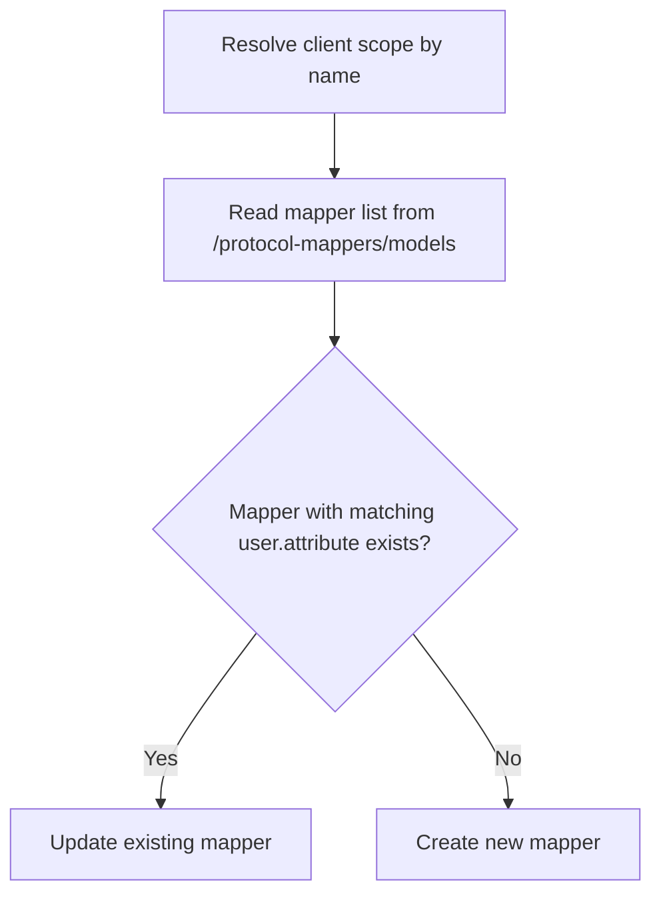

# Client Scopes and Mappers

This section documents the client-scope and protocol-mapper surface used by the identifier-attribute workflow.

## DTOs

- `ClientScopeDto`
- `ClientScopesProtocolMapperDto`
- `ClientScopesProtocolMapperConfigDto`

## `ClientScopesProtocolMapperConfigDto`

`ClientScopesProtocolMapperDto` stores mapper config as a dedicated DTO instead of raw array.

Benefits:

- consistent validation for config keys/values;
- explicit API (`has`, `get`, `toArray`);
- less accidental typo-prone array access.

Typical keys for `oidc-usermodel-attribute-mapper`:

- `user.attribute`
- `claim.name`
- `jsonType.label`
- `id.token.claim`
- `access.token.claim`
- `userinfo.token.claim`
- `introspection.token.claim`
- `lightweight.claim`
- `multivalued`
- `aggregate.attrs`

## Why Dedicated Mapper Lookup Matters

The identifier-attribute workflow does not rely on `protocolMappers` being embedded in a client-scope list response. Instead, it uses a dedicated read method for mapper models.

Reason:

- Keycloak may return a valid `ClientScopeRepresentation` without embedded mapper models;
- using embedded data as the source of truth would make create-vs-update decisions depend on response shape instead of actual mapper existence;
- the dedicated mapper endpoint gives a more stable contract for upsert logic.

## HTTP Operations

Handled by `ClientScopeManagementHttpClientInterface`:

- list scopes by realm;
- get scope by id;
- get protocol mappers by client-scope id;
- create/update/delete scope;
- create/update/delete protocol mapper.

These operations map to Keycloak Admin REST endpoints under:

- `/admin/realms/{realm}/client-scopes`
- `/admin/realms/{realm}/client-scopes/{scopeId}`
- `/admin/realms/{realm}/client-scopes/{scopeId}/protocol-mappers/models`

## Identifier Mapper Matching Rule

For `KeycloakUserIdentifierAttributeService`, an existing mapper is considered a match when:

- `protocolMapper === oidc-usermodel-attribute-mapper`
- mapper config contains `user.attribute=<attributeName>`

This rule keeps the upsert logic focused on application intent rather than on mapper display name alone.
