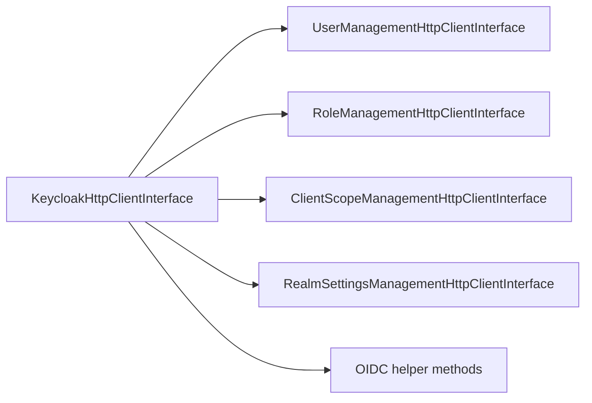

# HTTP Layer

## Facade Contract

`KeycloakHttpClientInterface` composes these contracts:

- `UserManagementHttpClientInterface`
- `RoleManagementHttpClientInterface`
- `ClientScopeManagementHttpClientInterface`
- `RealmSettingsManagementHttpClientInterface`

Plus OIDC/JWT helper methods:

- `requestTokenByPassword`
- `refreshToken`
- `getOpenIdConfiguration`
- `getJwk`
- `getJwks`
- `getAvailableRealms`

## Specialized Clients

### User management

- create/update/delete/search users;
- reset password;
- realm creation.

### Role management

- list/create/delete roles;
- assign/unassign roles;
- list available roles for a specific user.

### Client scope management

- list/get/create/update/delete client scopes;
- list protocol mappers for a specific client scope;
- create/update/delete protocol mappers for client scopes.

### Realm settings management

- read user profile definition;
- create/update/delete user profile attributes.

### OIDC interaction

- password grant token request;
- refresh token flow;
- OpenID configuration and JWK retrieval.

## When To Use Direct HTTP Access

Prefer the HTTP layer when:

- you need low-level control over DTO payloads;
- you want to compose your own workflow on top of Keycloak endpoints;
- you do not want service-layer defaults or orchestration.

Prefer the service layer when:

- the operation is inherently multi-step;
- you want application-oriented intent instead of endpoint-oriented code;
- you want the library to handle lookup, branching, and upsert logic for you.
