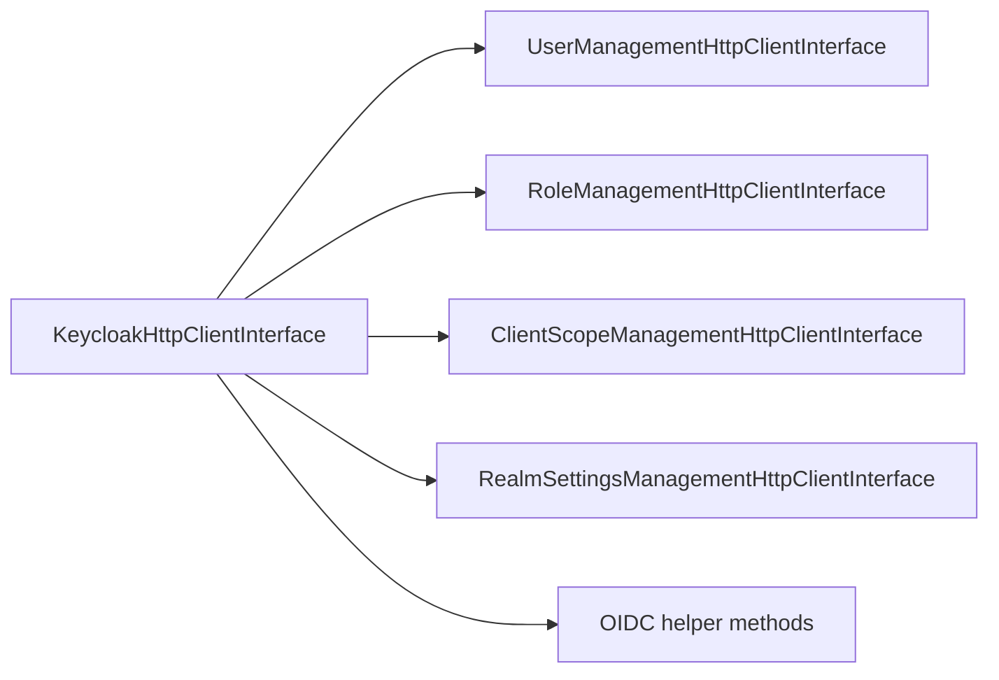
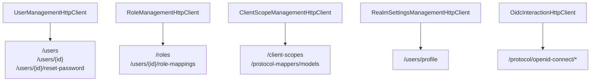

# HTTP Layer

This document describes the transport foundation used by the service layer. It is primarily useful for contributors and for teams building custom services on top of the library internals.

## Facade Contract

`KeycloakHttpClientInterface` composes these contracts:

- `UserManagementHttpClientInterface`
- `RoleManagementHttpClientInterface`
- `ClientScopeManagementHttpClientInterface`
- `RealmSettingsManagementHttpClientInterface`

Plus OIDC/JWT helper methods:

- `requestTokenByPassword`
- `refreshToken`
- `getOpenIdConfiguration`
- `getJwk`
- `getJwks`
- `getAvailableRealms`

## Transport Philosophy

The HTTP layer is intentionally narrow:

- one method should correspond to one Keycloak operation or closely related endpoint contract;
- DTOs at this layer are transport-facing and map closely to request or response shapes;
- the layer should not resolve mappers, infer business defaults or decide workflow branches.

This keeps transport code predictable and easy to reason about as the infrastructure beneath the service layer.

## Specialized Clients

### User management

- create/update/delete/search users;
- get user by id;
- reset password;
- realm creation.

### Role management

- list/create/delete roles;
- assign/unassign roles;
- list available roles for a specific user.

### Client scope management

- list/get/create/update/delete client scopes;
- list protocol mappers for a specific client scope;
- create/update/delete protocol mappers for client scopes.

### Realm settings management

- read user profile definition;
- create/update/delete user profile attributes.

### OIDC interaction

- password grant token request;
- refresh token flow;
- OpenID configuration and JWK retrieval.

## Endpoint Grouping

## Error Semantics

At this layer, errors are surfaced as transport-oriented failures:

- non-2xx responses become exceptions;
- request/response DTO mismatch is treated as a client-side contract problem;
- retry, fallback or create-vs-update branching belongs in the service layer, not here.

## Boundary Position

For normal application integration, this layer is not the recommended entry point.

Recommended usage:

- application code depends on `KeycloakServiceInterface`;
- the service layer depends on `KeycloakHttpClientInterface`;
- custom transport-aware extensions should usually be expressed as custom services, not as direct application calls to transport clients.
