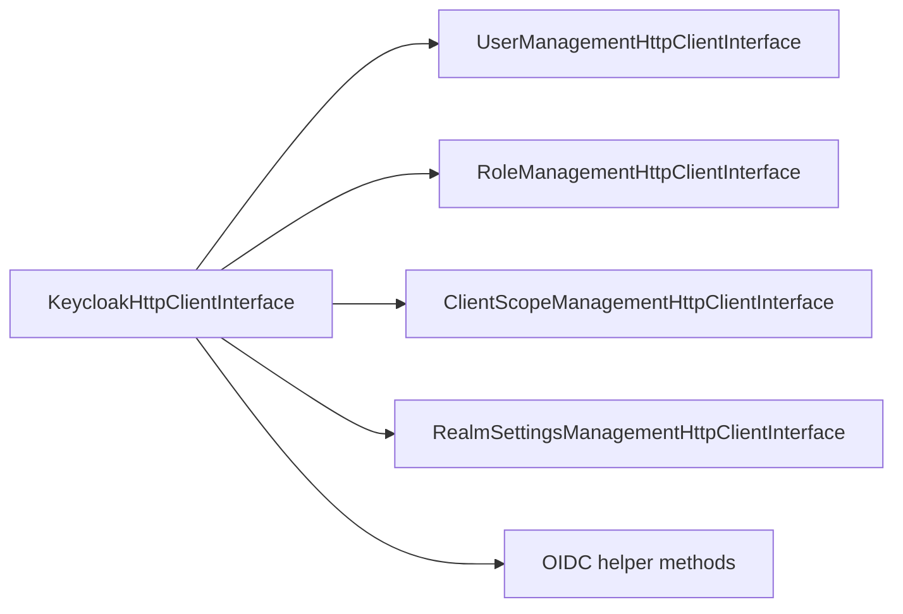
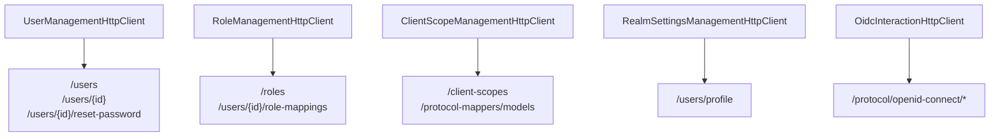

# HTTP Layer

This document describes the transport foundation used by the service layer. It is primarily useful for contributors and for teams building custom services on top of the library internals.

## Facade Contract

`KeycloakHttpClientInterface` composes these contracts:

- `UserManagementHttpClientInterface`
- `RoleManagementHttpClientInterface`
- `ClientScopeManagementHttpClientInterface`
- `RealmSettingsManagementHttpClientInterface`

Plus OIDC/JWT helper methods:

- `requestTokenByPassword`
- `refreshToken`
- `getOpenIdConfiguration`
- `getJwk`
- `getJwks`
- `getAvailableRealms`


```mermaid
flowchart LR
    Facade["KeycloakHttpClientInterface"]
    Facade --> User["UserManagementHttpClientInterface"]
    Facade --> Role["RoleManagementHttpClientInterface"]
    Facade --> Scope["ClientScopeManagementHttpClientInterface"]
    Facade --> Realm["RealmSettingsManagementHttpClientInterface"]
    Facade --> Oidc["OIDC helper methods"]
```

## Transport Philosophy

The HTTP layer is intentionally narrow:

- one method should correspond to one Keycloak operation or closely related endpoint contract;
- DTOs at this layer are transport-facing and map closely to request or response shapes;
- the layer should not resolve mappers, infer business defaults or decide workflow branches.

Request DTO namespaces mirror these transport boundaries:

- `DTO\Request\User\*`
- `DTO\Request\Role\*`
- `DTO\Request\ClientScope\*`
- `DTO\Request\Realm\UserProfile\*`
- `DTO\Request\Oidc\*`

This keeps transport code predictable and easy to reason about as the infrastructure beneath the service layer.

## Specialized Clients

### User management

- create/update/delete/search users;
- get user by id;
- reset password;
- password-reset transport calls without service-layer workflow decisions.

### Role management

- list/create/delete roles;
- assign/unassign roles;
- list available roles for a specific user.

### Client scope management

- list/get/create/update/delete client scopes;
- list protocol mappers for a specific client scope;
- create/update/delete protocol mappers for client scopes.

### Realm settings management

- read user profile definition;
- create/update/delete user profile attributes.

### OIDC interaction

- password grant token request;
- refresh token flow;
- OpenID configuration and JWK retrieval.

## Endpoint Grouping


```mermaid
flowchart TB
    User["UserManagementHttpClient"] --> UserEndpoints["/users\n/users/{id}\n/users/{id}/reset-password"]
    Role["RoleManagementHttpClient"] --> RoleEndpoints["/roles\n/users/{id}/role-mappings"]
    Scope["ClientScopeManagementHttpClient"] --> ScopeEndpoints["/client-scopes\n/protocol-mappers/models"]
    Realm["RealmSettingsManagementHttpClient"] --> RealmEndpoints["/users/profile"]
    Oidc["OidcInteractionHttpClient"] --> OidcEndpoints["/protocol/openid-connect/*"]
```

## Error Semantics

At this layer, Keycloak failures are surfaced as typed transport exceptions rather than generic runtime failures.

Non-2xx Keycloak responses map to:

- `401` -> `KeycloakAuthenticationException`
- `403` -> `KeycloakAuthorizationException`
- `404` -> `KeycloakNotFoundException`
- `409` -> `KeycloakConflictException`
- `429` -> `KeycloakRateLimitException`
- `5xx` -> `KeycloakServerException`
- other non-2xx responses -> `KeycloakTransportException`

Malformed or unexpected successful responses map to:

- invalid JSON -> `KeycloakInvalidResponseException`
- valid JSON with an unexpected shape for the expected DTO/entity -> `KeycloakInvalidResponseException`

Transport/client failures map to:

- PSR-18 client failures -> `KeycloakTransportException`

Request payload serialization stays separate from remote failure handling:

- `json_encode(..., JSON_THROW_ON_ERROR)` for request DTOs is treated as a local programming/configuration failure, not as a Keycloak HTTP failure

Short example:

```php
use Apacheborys\KeycloakPhpClient\Exception\KeycloakAuthorizationException;

try {
    $httpClient->getUsers($dto);
} catch (KeycloakAuthorizationException $exception) {
    $context = $exception->getContext();

    // GET https://keycloak.example/admin/realms/master/users?exact=true
    $method = $context->getMethod();
    $uri = $context->getUri();
    $status = $context->getStatusCode();
}
```

## Diagnostic Context

Every typed Keycloak exception exposes `getContext(): KeycloakErrorContext`.

The context includes:

- HTTP method
- sanitized URI or path
- HTTP status code, when available
- response body
- parsed Keycloak `error`
- parsed Keycloak `error_description`
- correlation/request id when Keycloak returned one

This makes transport failures easier to log and debug without pushing Keycloak-specific parsing into the service layer.

## Security Notes

Exception diagnostics are intentionally safe for logs:

- exception messages do not include the `Authorization` header
- exception messages do not include bearer tokens
- exception messages do not include `client_secret`, `refresh_token`, `access_token`, `password`, or raw sensitive query-param values
- sensitive query parameters are redacted in diagnostic URIs
- request body is not stored in `KeycloakErrorContext` by default
- response body may be stored because it is the server response being diagnosed

For example, a token endpoint URI may be logged as:

```text
https://keycloak.example/realms/master/protocol/openid-connect/token?client_id=backend&client_secret=[redacted]
```

## Boundary Position

For normal application integration, this layer is not the recommended entry point.

Recommended usage:

- application code depends on `KeycloakServiceInterface`;
- the service layer depends on `KeycloakHttpClientInterface`;
- custom transport-aware extensions should usually be expressed as custom services, not as direct application calls to transport clients.

The boundary is intentional:

- the HTTP layer maps transport and response failures into typed Keycloak exceptions
- the service layer remains responsible for retry, fallback, conflict resolution, and higher-level business workflow decisions
