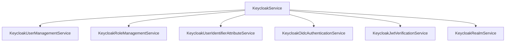

# Service Layer

## Main Facade

`KeycloakServiceInterface` aggregates:

- user management;
- user identifier attribute management;
- OIDC authentication;
- JWT verification;
- realm listing.

Use the service layer when your application wants a business operation instead of a single REST call. If you already know the exact Keycloak endpoint shape you want to control, prefer the HTTP layer directly.

## Service Composition

## Responsibilities

### `createUser`

- creates user via `KeycloakUserManagementService`;
- synchronizes roles via `KeycloakRoleManagementService`;
- fetches final user representation by id.

### `updateUser`

- updates user profile via `KeycloakUserManagementService`;
- synchronizes role assignments/unassignments;
- fetches final user representation by id.

### `findUser`

- resolves realm from mapper;
- reads the Keycloak user id from `KeycloakUserInterface::getKeycloakId()`;
- fetches the current Keycloak representation through the dedicated user-by-id endpoint.

### `deleteUser`

- delegates deletion workflow to `KeycloakUserManagementService`.

### `ensureUserIdentifierAttribute`

Handled by `KeycloakUserIdentifierAttributeService`:

- uses the explicit realm provided by the caller;
- checks realm user-profile attribute existence;
- optionally creates missing attribute;
- optionally creates/updates protocol mapper in client scope for JWT exposure.

This method is designed for application bootstrap or migration-like initialization. It lets the application declare:

- which user-profile attribute must exist in the target realm;
- whether the attribute may be auto-created;
- whether the same value must be exposed as a JWT claim.

The method intentionally hides the multi-step orchestration required to make this safe and predictable.

### `loginUser` and `refreshToken`

- delegated to `KeycloakOidcAuthenticationService`.

### `verifyJwt`

- delegated to `KeycloakJwtVerificationService`.

## Service Boundary Notes

- Services are the right place for defaults such as the identifier-attribute payload and default JWT claim name.
- Services may perform multiple HTTP calls to complete one operation.
- Services should prefer stable Keycloak contracts over incidental response shape.
- Services are allowed to throw workflow-level exceptions such as "required attribute is missing and auto-create is disabled".
