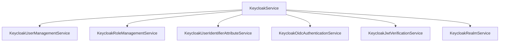
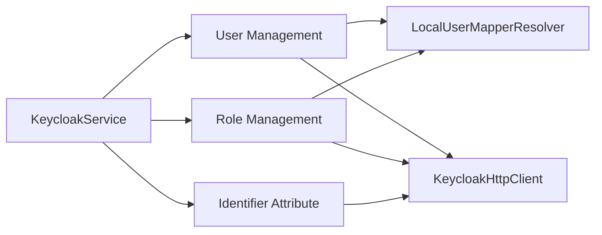

# Service Layer

## Main Facade

`KeycloakServiceInterface` aggregates:

- user management;
- role management;
- user identifier attribute management;
- OIDC authentication;
- JWT verification;
- realm listing.

In practice, the facade mixes two kinds of operations:

- orchestration methods such as `createUser`, `updateUser`, `ensureUserIdentifierAttribute`;
- convenience pass-through methods such as `searchUsers`, `findUserById`, `loginUser`.

Application code should integrate through the service layer. Even when an operation is only one transport call today, keeping it behind the service boundary preserves a consistent integration style and leaves room for future orchestration, defaults or validation without changing the application contract.

## Service Composition

`KeycloakServiceFactory` wires shared service helpers at this boundary. In particular, it creates one `KeycloakUserLookup` and injects it into user and role management services instead of letting those services construct their own lookup helper.

## Method Selection Guide

- Use `findUser(localUser)` when your application already has a local user object and wants mapper-based realm resolution.
- Use `findUserById(realm, userId)` when your application already knows both the realm and the Keycloak user id.
- Use `searchUsers(SearchUsersDto)` when your application needs repository-style lookup with filters and pagination.
- Use `createUser` or `updateUser` when mapper-driven transformation from local user shape to Keycloak payload is part of the use case.

## Responsibilities

### `createUser`

- creates user via `KeycloakUserManagementService`;
- synchronizes roles via `KeycloakRoleManagementService`;
- can persist the local application id through `CreateUserProfileDto` attributes because no Keycloak user id exists before creation;
- uses `UserRolesDto` from `prepareLocalUserRolesForKeycloakUserCreation(...)` for role synchronization;
- creates missing realm roles and assigns them when the mapper returns a non-empty role list;
- skips role synchronization when the mapper returns an empty role list;
- fetches final user representation by id.

### `updateUser`

- updates user profile via `KeycloakUserManagementService`;
- synchronizes role assignments/unassignments;
- uses `UserRolesDto` from `prepareLocalUserRolesForKeycloakUserUpdate(...)` for role synchronization;
- matches old and new local user versions by `KeycloakUserInterface::getId()`;
- resolves the target Keycloak user id in the service layer, using `getKeycloakId()` first and the mapper-provided local-id attribute DTO fallback second;
- passes the mapper-provided attribute DTO into `KeycloakUserLookup` instead of letting the lookup helper read `KeycloakUserInterface` directly;
- allows mapper-created `UpdateUserDto::getUserId()` to be null;
- validates `UpdateUserDto::getLocalUserId()` against the local user id and keeps that value out of the Keycloak payload;
- creates missing desired realm roles and synchronizes mappings when the mapper returns a non-empty role list;
- skips role synchronization when the mapper returns null or an empty role list;
- fetches final user representation by id.

The user-management step owns local/Keycloak identity validation and never requests available roles. The role-management step owns available-role lookup, resolves the Keycloak target user id through `KeycloakUserLookup`, and applies the role diff.

### `deleteUser`

- delegates deletion coordinates to the mapper-created `DeleteUserDto`;
- resolves the target Keycloak user id in the service layer, using `getKeycloakId()` first and the mapper-provided local-id attribute DTO fallback second;
- validates `DeleteUserDto::getLocalUserId()` against `KeycloakUserInterface::getId()`;
- allows mapper-created `DeleteUserDto::getUserId()` to be null;
- deletes the user through the dedicated user-by-id endpoint.

### `findUser`

- resolves realm from mapper;
- resolves the target Keycloak id via `KeycloakUserLookup`;
- uses `KeycloakUserInterface::getKeycloakId()` first;
- otherwise searches by the mapper-provided local-id attribute DTO to resolve the Keycloak id;
- loads the final representation through `findUserById`;
- throws when the local-id lookup does not return exactly one Keycloak user.

### `findUserById`

- performs direct user lookup by explicit realm and Keycloak user id;
- skips mapper resolution because the caller already provides the required lookup coordinates;
- is useful for workflows that persist Keycloak ids externally.

### `searchUsers`

- delegates user repository search to `KeycloakUserManagementService`;
- accepts `SearchUsersDto` as a query object with realm, filters and pagination;
- returns the current Keycloak user representations matching the query.

### `ensureUserIdentifierAttribute`

Handled by `KeycloakUserIdentifierAttributeService`:

- uses the explicit realm provided by the caller;
- checks realm user-profile attribute existence;
- optionally creates missing attribute;
- optionally creates/updates protocol mapper in client scope for JWT exposure.

This method is designed for application bootstrap or migration-like initialization. It lets the application declare:

- which user-profile attribute must exist in the target realm;
- whether the attribute may be auto-created;
- whether the same value must be exposed as a JWT claim.

The method intentionally hides the multi-step orchestration required to make this safe and predictable.

### `loginUser` and `refreshToken`

- delegated to `KeycloakOidcAuthenticationService`.

### `verifyJwt`

- delegated to `KeycloakJwtVerificationService`.

## Service Boundary Notes

- Services are the right place for defaults such as the identifier-attribute payload and default JWT claim name.
- Services may perform multiple HTTP calls to complete one operation.
- Services should prefer stable Keycloak contracts over incidental response shape.
- `SearchUsersDto` is acceptable at the service boundary because it models a repository query, not a raw transport payload.
- Services are allowed to throw workflow-level exceptions such as "required attribute is missing and auto-create is disabled".
- Role naming is a mapper policy. The mapper should apply any prefix/suffix before returning role DTOs.
- Missing returned roles are created by the service; return no roles when role management should not run for that local user type.

## Service Patterns

Interpretation:

- orchestration lives in focused services rather than in the facade itself;
- mapper resolution is a dependency of user- and role-oriented workflows, not of the HTTP layer;
- the facade stays small and coordinates service composition rather than re-implementing workflow logic.
- application code should depend on this facade/service graph rather than on transport clients directly.
