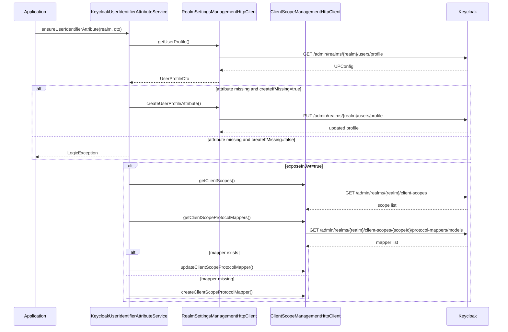
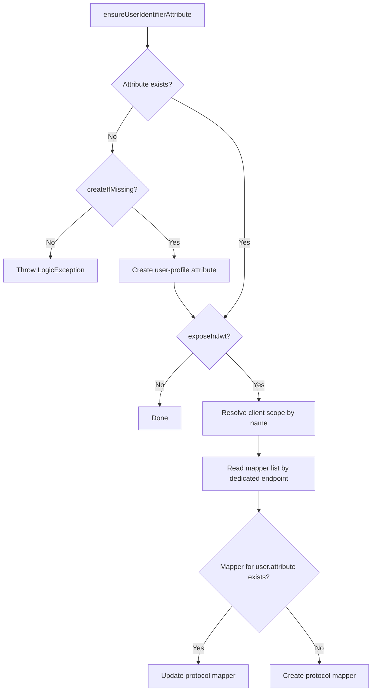

# User Profile Attributes

This section describes realm user-profile attributes (`/admin/realms/{realm}/users/profile`) and service-level orchestration for custom identifier attributes.

## Why This Feature Exists

Some applications need one or more stable identifiers that:

- exist as explicit Keycloak user-profile attributes;
- can be initialized automatically during bootstrap or migration-like flows;
- are exposed directly in JWT payloads to avoid additional round-trips to Keycloak or another repository at runtime.

`KeycloakUserIdentifierAttributeService` exists to turn that requirement into one application-facing operation instead of several low-level Admin REST calls.

## Service DTO

`EnsureUserIdentifierAttributeDto` (service-level):

- `attributeName`
- `displayName`
- `createIfMissing`
- `exposeInJwt`
- `clientScopeName` (default: `profile`)
- `jwtClaimName` (default: kebab-case to snake_case conversion)
- `protocolMapperName` (default: `<displayName> attribute`)

## Attribute Model Notes

`AttributeDto` now has first-class support for Keycloak `required` rules through `AttributeRequiredDto`.

Supported typed fields:

- `roles`
- `scopes`

Unknown fields inside `required` are still preserved and round-tripped.

## What The Service Manages

The workflow coordinates two different Keycloak concerns:

1. Realm user-profile configuration under `/admin/realms/{realm}/users/profile`.
2. Optional JWT exposure through an OIDC user-attribute protocol mapper in a client scope.

The service does not try to become a generic Keycloak schema editor. It manages a narrow, application-focused surface while keeping unsupported upstream fields intact.

## Service Flow

`KeycloakUserIdentifierAttributeService::ensureUserIdentifierAttribute()`:

1. Use the provided realm.
2. Read current user profile.
3. If attribute is missing:
   - throw exception when `createIfMissing=false`;
   - create attribute when `createIfMissing=true`.
4. If `exposeInJwt=true`:
   - read client scopes in realm;
   - resolve target scope by name;
   - read protocol mappers from the dedicated client-scope mapper endpoint;
   - upsert protocol mapper (`oidc-usermodel-attribute-mapper`) for `user.attribute=<attributeName>`.



## Decision Matrix



Practical outcomes:

- `createIfMissing=false`, `exposeInJwt=false`
  The method only validates that the attribute already exists.
- `createIfMissing=true`, `exposeInJwt=false`
  The method can bootstrap the attribute, but does not touch JWT mapping.
- `createIfMissing=false`, `exposeInJwt=true`
  The method requires the attribute to exist already and only manages mapper exposure.
- `createIfMissing=true`, `exposeInJwt=true`
  The method fully bootstraps both the attribute and its JWT exposure path.

## Permissions and Defaults

When auto-creating attribute, default payload includes:

- `permissions.view`: `admin`, `user`
- `permissions.edit`: `admin`, `user`
- `required.roles`: `admin`, `user`
- `annotations.inputType`: `text`
- `multivalued`: `false`

Example shape of `required`:

```json
{
  "required": {
    "roles": ["admin", "user"],
    "scopes": ["openid"]
  }
}
```

## Design Guarantees

### Lossless user-profile updates

Realm user-profile configuration behaves like a document API. The library reads the full configuration document, mutates the managed attribute, and writes the document back while preserving unknown fields. This is important because real Keycloak realms may already contain fields that the library does not model explicitly.

### Open-door schema handling

The user-profile model intentionally keeps unsupported upstream fields instead of rejecting or deleting them:

- unknown top-level user-profile fields are preserved;
- unknown attribute and group fields are preserved;
- custom permissions, annotations, and validator types are accepted and round-tripped.

This keeps the supported API surface intentionally small without closing the door to future Keycloak schema evolution.

### Dedicated source of truth for mapper existence

Mapper upsert does not depend on `protocolMappers` being embedded in a client-scope list response. The service resolves the scope by name and then reads mapper models from the dedicated `/protocol-mappers/models` endpoint before deciding between create and update.

## What The Service Intentionally Does Not Manage

- it does not attempt to expose the full Keycloak user-profile schema as a first-class builder API;
- it does not try to manage every possible protocol-mapper type;
- it does not hide all possible Keycloak race conditions across multiple concurrent application instances;
- it does not replace direct HTTP access when you need low-level control over every payload field.
